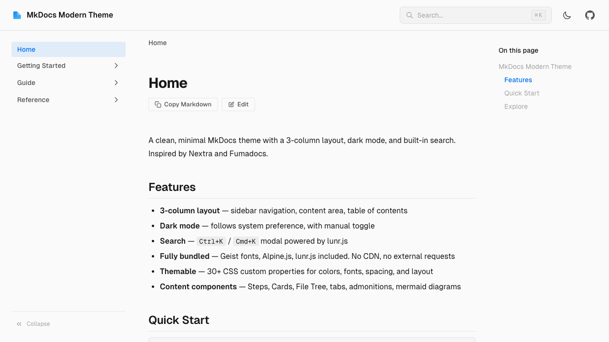
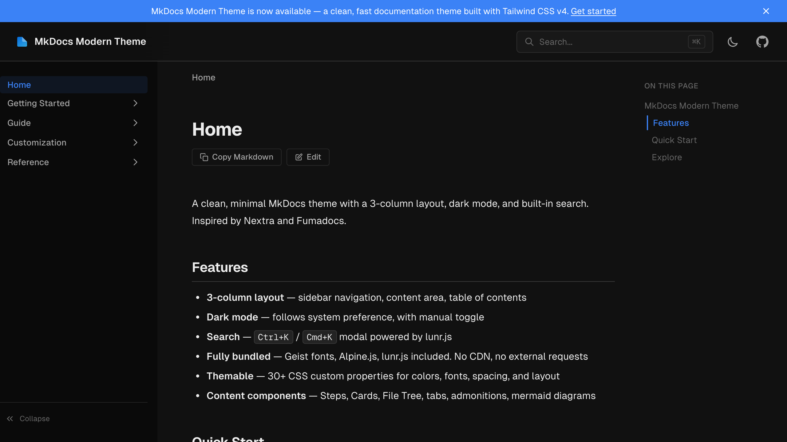

# mkdocs-modern-theme

[](https://github.com/ralph089/mkdocs-modern-theme/releases)
[](https://github.com/ralph089/mkdocs-modern-theme/blob/main/LICENSE)
[](https://www.python.org/)
[](https://www.mkdocs.org/)
[](https://ralph089.github.io/mkdocs-modern-theme/)
[](https://www.conventionalcommits.org/)

A modern, fully-bundled MkDocs theme with a 3-column layout, dark mode, and built-in search. No CDN, no external requests.

**[Documentation](https://ralph089.github.io/mkdocs-modern-theme/)** | **[Getting Started](https://ralph089.github.io/mkdocs-modern-theme/getting-started/)** | **[Configuration](https://ralph089.github.io/mkdocs-modern-theme/configuration/)**




## Install

```bash
# uv (recommended)
uv add mkdocs-modern-theme@git+https://github.com/ralph089/mkdocs-modern-theme.git@v{version}

# pip
pip install git+https://github.com/ralph089/mkdocs-modern-theme.git@v{version}
```

```yaml
# mkdocs.yml
theme:
  name: modern
```

## Features

- **3-column layout** — sidebar, content, table of contents
- **Dark / light / system mode** — three-way toggle with system detection
- **Search** — Ctrl+K / Cmd+K modal powered by lunr.js
- **Fully bundled** — Geist fonts, Alpine.js, lunr.js all included. No CDN, no external requests
- **8 color presets** — ocean, purple, rose, emerald, amber, slate, ruby, default
- **30+ CSS custom properties** — full control over colors, fonts, spacing, layout
- **Responsive** — mobile sidebar overlay, adaptive breakpoints
- **Content components** — steps, cards, file tree, tabs, admonitions, mermaid diagrams, code blocks
- **Image lightbox** — powered by glightbox
- **Announcement bar** — dismissible, customizable color
- **Breadcrumbs** — auto-generated from nav tree
- **Previous / Next navigation** — automatic page links
- **Page feedback** — "Was this helpful?" widget
- **i18n** — built-in translations for de, es, fr, ja, zh_CN
- **Print styles** — hides chrome, expands links
- **Accessible** — focus rings, reduced-motion support, semantic HTML

## Theme Options

```yaml
theme:
  name: modern
  color_mode: system              # system | light | dark
  color_theme: default            # default | ocean | purple | rose | emerald | amber | slate | ruby
  navigation_depth: 3             # sidebar nesting depth
  show_toc: true                  # table of contents panel
  show_breadcrumbs: true          # breadcrumb navigation
  show_prev_next: true            # previous/next page links
  show_edit_link: false           # edit on repository link
  show_copy_markdown: true        # copy markdown source button
  show_last_updated: true         # last updated date
  show_feedback: true             # page feedback widget
  announcement: ""                # banner message (HTML allowed)
  announcement_dismissible: true  # allow dismissing announcement
  announcement_color: ""          # custom announcement bar color
  logo: null                      # path to logo image
  locale: en                      # en | de | es | fr | ja | zh_CN
```

## Customization

Override design tokens with a CSS file:

```yaml
extra_css:
  - css/custom.css
```

```css
:root {
  --modern-accent: #e11d48;
  --modern-surface: #fef2f2;
  --modern-font-sans: "Inter", sans-serif;
}
```

See the full list of custom properties in the [Theming guide](https://ralph089.github.io/mkdocs-modern-theme/customization/theming/).

## Development

Requires [uv](https://docs.astral.sh/uv/) and [pnpm](https://pnpm.io/).

```bash
make install    # uv sync + pnpm install
make dev        # CSS watch + mkdocs serve (localhost:8000)
make build      # build CSS + site
make test       # build + Playwright E2E tests
```

______________________________________________________________________

<p align="center">
  If you find this theme useful, please consider giving it a<br>
  <a href="https://github.com/ralph089/mkdocs-modern-theme">
    
  </a>
</p>

## License

MIT
