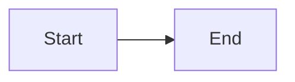
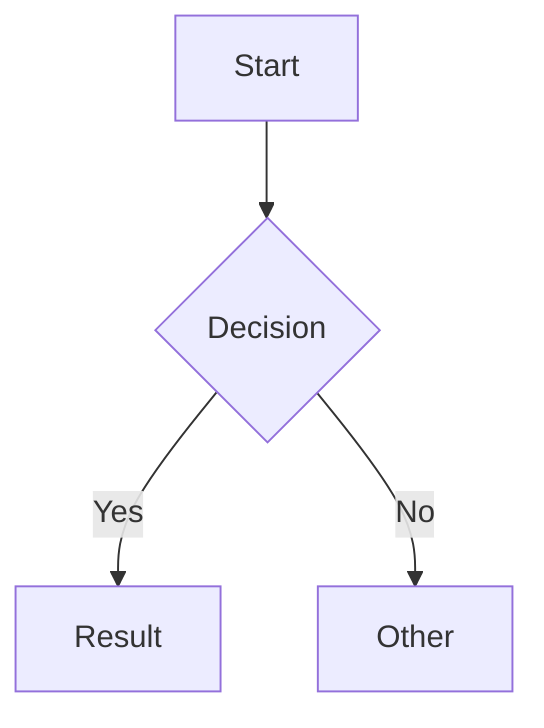
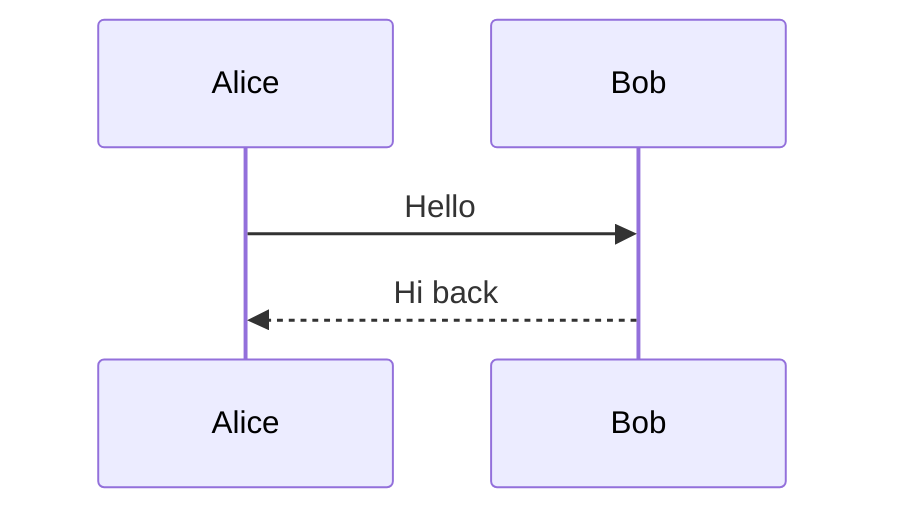
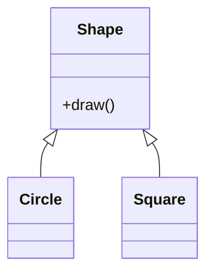
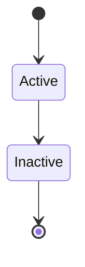

# Mermaid Diagrams

The Modern theme includes built-in support for [Mermaid](https://mermaid.js.org/) diagrams. Diagrams are rendered client-side and automatically adapt to light and dark mode.

## Setup

Add the mermaid custom fence to your `mkdocs.yml`:

```yaml
markdown_extensions:
  - pymdownx.superfences:
      custom_fences:
        - name: mermaid
          class: mermaid
          format: !!python/name:mkdocs_modern_theme.mermaid.fence_mermaid
```

## Usage

Write mermaid diagrams using fenced code blocks with the `mermaid` language identifier:

~~~markdown

~~~

## Supported Diagram Types

All [Mermaid diagram types](https://mermaid.js.org/intro/) are supported. The most common:

### Flowcharts



### Sequence Diagrams



### Class Diagrams



### State Diagrams



## Dark Mode

Diagrams automatically switch between mermaid's `default` and `dark` themes when you toggle the site's color mode. No additional configuration is needed.

## See also

- [Extensions](../extensions.md) — configuring `pymdownx.superfences` with `custom_fences`
- [Code Blocks](code-blocks.md) — standard syntax-highlighted code blocks
