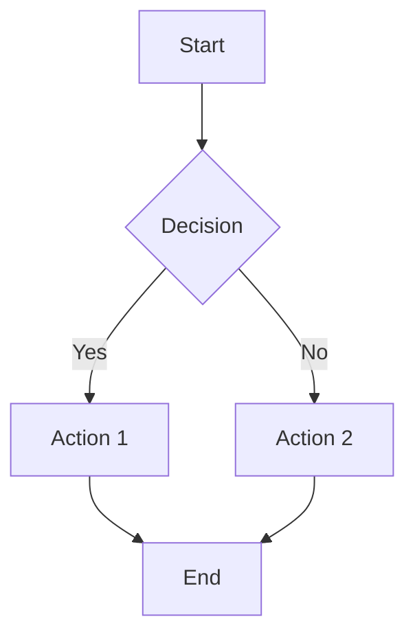
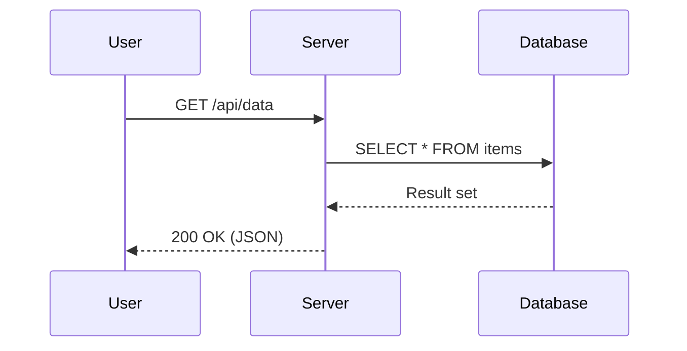
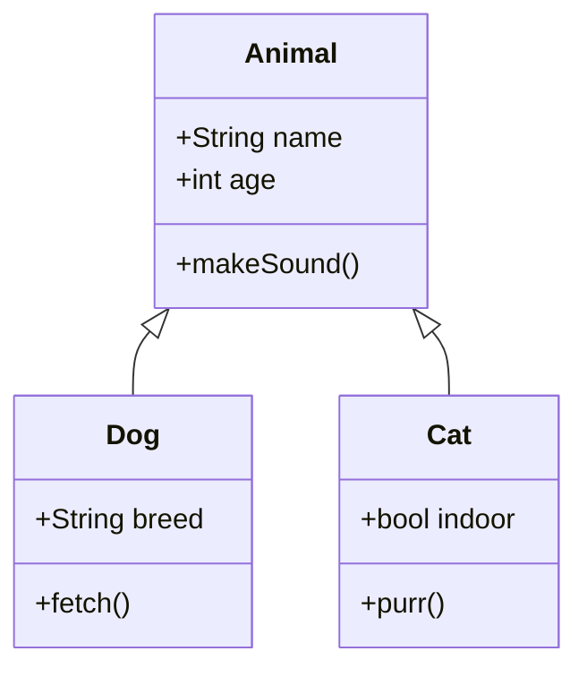
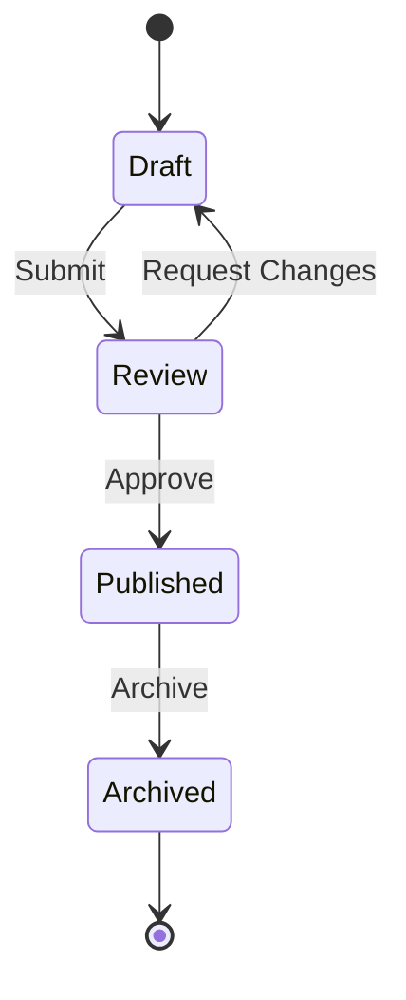

# Mermaid Diagrams

The theme supports mermaid diagrams rendered client-side.

## Flowchart

```mermaid
graph TD
    A[Start] --> B{Decision}
    B -->|Yes| C[Action 1]
    B -->|No| D[Action 2]
    C --> E[End]
    D --> E
```

## Sequence Diagram

```mermaid
sequenceDiagram
    participant U as User
    participant S as Server
    participant D as Database
    U->>S: GET /api/data
    S->>D: SELECT * FROM items
    D-->>S: Result set
    S-->>U: 200 OK (JSON)
```

## Class Diagram

```mermaid
classDiagram
    class Animal {
        +String name
        +int age
        +makeSound()
    }
    class Dog {
        +String breed
        +fetch()
    }
    class Cat {
        +bool indoor
        +purr()
    }
    Animal <|-- Dog
    Animal <|-- Cat
```

## State Diagram

```mermaid
stateDiagram-v2
    [*] --> Draft
    Draft --> Review : Submit
    Review --> Published : Approve
    Review --> Draft : Request Changes
    Published --> Archived : Archive
    Archived --> [*]
```
